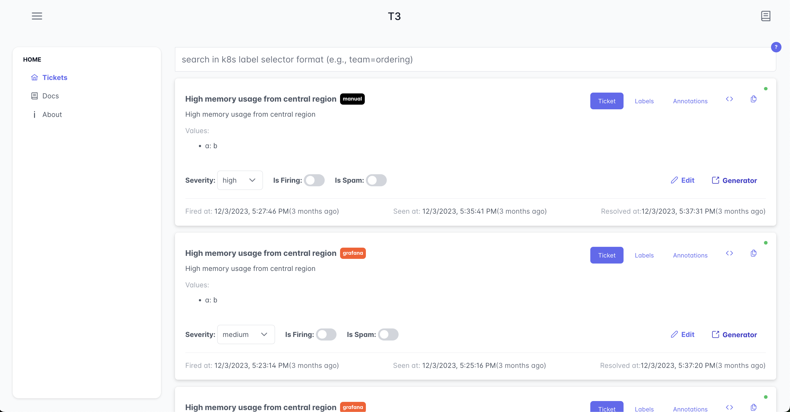

T3(The Ticket Tracker) tracks the tickets (e.g., grafana alerts).




__Project status__: Under development. it's not stable yet.

### Features
- Track the Grafana alerts and manual tickets.
- Update tickets through chat (currently we support matrix).
- Save metrics about tickets (time to see, time to resolve)
- mark spam tickets to do not affect the reporting system.
- Grafana dashboard about the tickets' metrics.

### Next Steps
- OnCall feature: System will automatically set the oncall user on each ticket.
- AI Assistant
  - The AI will analyze your comments on channels and update tickets.
  - It will help you find the root cause of an issue.
- Ticket merging: Sometimes you may have a lot of tickets for one incident, in that case we'll merge all related tickets.
- Auto postmortem generator.

You can read more about the next steps [here](./docs/general/next_steps.md).

### API Docs
You can find the OpenAPI docs [here](./docs/api/api_docs.json).


__Prerequisites__

- Postgres

### How to run the project

- generate config file: `cp config.example.yaml config.yaml`
- generate channels file: `cp chanenls.example.yaml channels.yaml`
- Update config and channels values.
- Run the server: `go run ./cmd/t3/main.go server listen`
- Run the UI server by following its steps [here](./webui/README.md)


### How to enable jaeger in local env

- Run jaeger:

```bash
docker run -d --name jaeger \
  -e COLLECTOR_ZIPKIN_HOST_PORT=:9411 \
  -p 5775:5775/udp \
  -p 6831:6831/udp \
  -p 6832:6832/udp \
  -p 5778:5778 \
  -p 16686:16686 \
  -p 14268:14268 \
  -p 14250:14250 \
  -p 9411:9411 \
  jaegertracing/all-in-one:1.26
```

- Update app's Jaeger config:

```yaml
open_telemetry:
  tracing:
    noop_tracer: false # set true to disable jaeger
    jaeger_addr: "http://localhost:14268/api/traces"
    always_sample: true # in production set to false.
```

### Deployment notes

- To run the app's server, run `{built_app} server listen` command.
- liveness, readiness endpoints:

```text
// liveness
http://{probe_server_address}/live

// Readiness
http://{probe_server_address}/ready
```

### Contribution
If you want to contribute to this project, [this doc](./contribution.md) can help you.

### TODO
- [ ] Write tests
